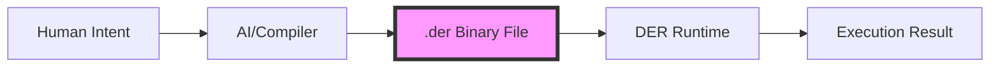

# DER vs Rust: Understanding the Difference

## The Confusion Explained

You noticed `.rs` files everywhere - that's because:
- **Rust** is the language we use to BUILD the DER system
- **DER** is the NEW language that runs INSIDE this system

Think of it like:
- **Chrome** is written in C++, but runs **JavaScript**
- **Python interpreter** is written in C, but runs **Python**
- **DER runtime** is written in Rust, but runs **DER**

## What IS a DER Program?

A DER program is a `.der` file containing:

```
[BINARY DATA - NOT TEXT]
┌────────────────────┐
│ Header (16 bytes)  │
│ Magic: "DER!"      │
│ Version: 1.0       │
│ Chunks: 3          │
├────────────────────┤
│ META chunk         │
│ - Entry point      │
│ - Capabilities     │
│ - Traits           │
├────────────────────┤
│ IMPL chunk         │
│ - Node 1: OpCode   │
│ - Node 2: OpCode   │
│ - Node 3: OpCode   │
├────────────────────┤
│ CNST chunk         │
│ - Strings          │
│ - Integers         │
│ - Floats           │
└────────────────────┘
```

## File Types in This Project

### `.rs` files (Rust)
- **Purpose**: Implement the DER runtime, compiler, tools
- **Examples**:
  - `src/runtime/executor.rs` - Executes DER programs
  - `src/core/binary_format.rs` - Defines DER format
  - `examples/hello_world.rs` - Creates DER programs

### `.der` files (DER)
- **Purpose**: Actual DER programs (binary format)
- **Examples**:
  - `hello.der` - DER hello world program
  - `sort.der` - DER sorting program
  - `output.der` - AI-generated DER program

## How It Works



## Example: Creating vs Running DER

### Creating a DER program (using Rust):
```rust
// This is Rust code that CREATES a DER program
let mut program = Program::new();
let idx = program.constants.add_string("Hello");
let node = Node::new(OpCode::ConstString, 1).with_args(&[idx]);
program.add_node(node);

// Save as .der file
let file = File::create("hello.der").unwrap();
let mut serializer = DERSerializer::new(file);
serializer.write_program(&program).unwrap();
```

### Running a DER program:
```bash
# This executes the .der binary file
cargo run --bin der run hello.der

# The .der file contains:
# - Binary opcodes (not Rust code)
# - Computational graph structure
# - Constants and metadata
```

## Why This Design?

1. **Bootstrapping**: Every new language needs an existing language to implement it
2. **Performance**: Rust provides memory safety and speed for the runtime
3. **Clear Separation**: DER programs (.der) are data, not Rust code

## The Key Innovation

DER programs are **NOT text files** like:
- `.py` (Python)
- `.js` (JavaScript)  
- `.rs` (Rust)

DER programs **ARE binary files** like:
- `.class` (Java bytecode)
- `.pyc` (Python bytecode)
- `.wasm` (WebAssembly)

But unlike those, DER:
- Has NO text representation at all
- Is designed for AI to generate directly
- Stores computation as graphs, not instructions

## Visual Comparison

### Traditional Language (like Rust):
```
hello.rs (text) → rustc → binary executable → OS runs it
```

### DER Language:
```
AI intent → DER compiler → hello.der (binary) → DER runtime executes it
                              ↓
                    (Never text format!)
```

## Summary

- **`.rs` files**: Tools to create/run DER programs (like a video player app)
- **`.der` files**: Actual DER programs (like video files)
- **No DER source code**: Because DER has no text syntax - it's binary-only
- **AI-native**: Machines create `.der` files directly without text

This is why DER is revolutionary - it's the first language with no human-readable syntax, designed purely for AI programmers!